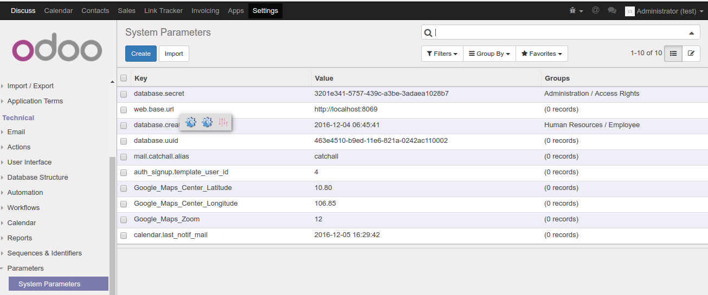
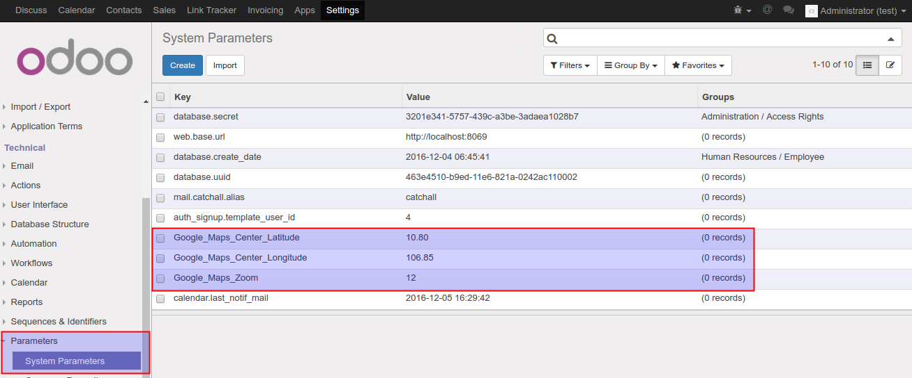
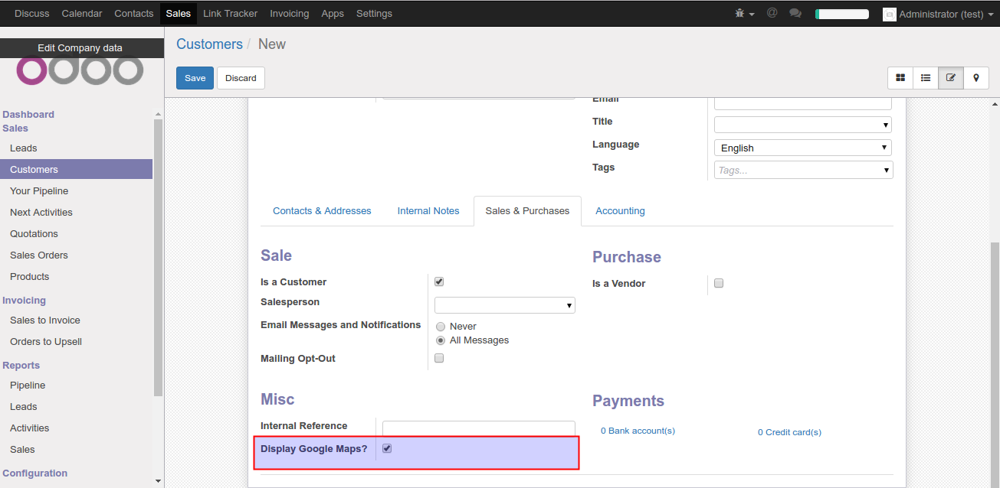
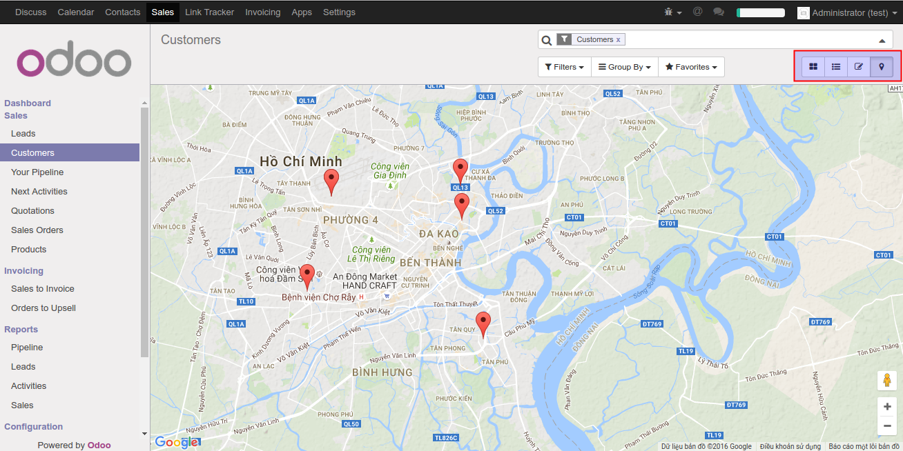

=======================
Partner Google Maps
=======================

This modules allows partners location to be displayed on  Google Map in Odoo.

Installation notes
===================

Set Google Maps Center, Zoom Level and Google Map API key
------------

   

   
Create a new partner and fill the address
------------
.. figure:: static/description/Selection_079.png
   :alt: Input Usage
   :scale: 80 %c
   :align: center
   :figclass: text-center
   
Select to display partner's map or not
------------

   
View partner's Google Maps
------------

Credits
=======

Contributors
------------

* Tuan Nguyen<tuannguyen36.vn@gmail.com>
* Paul Ntabuye Butera <paul.n.butera@abakusitsolutions.eu>

Maintainer
-----------

.. image:: http://www.abakusitsolutions.eu/wp-content/themes/abakus/images/logo.gif
   :alt: AbAKUS IT SOLUTIONS
   :target: http://www.abakusitsolutions.eu

This module is maintained by AbAKUS IT SOLUTIONS